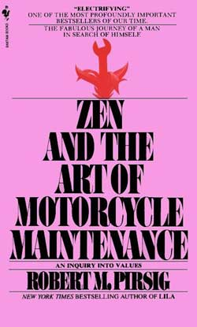
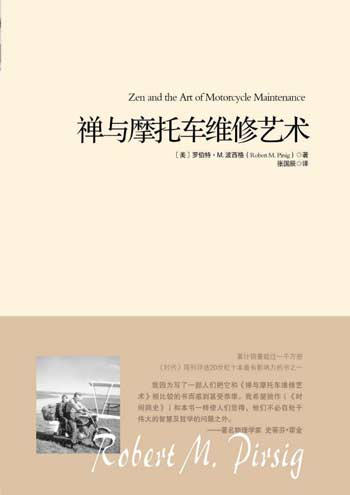

《禅与摩托车维修艺术》读后感
作者： 阮一峰
日期： 2011年12月18日
http://www.ruanyifeng.com/blog/2011/12/zen_and_the_art_of_motorcycle_maintenance.html

过去两个月，我一直在读这本400页的书。
这是我今年读过的最有价值的好书之一。

它很独特，一半是游记，讲述作者与儿子的一次摩托车旅行，从明尼苏达州一直到加州，耗时17天；另一半是哲学讨论，作者剖析自己的思想，寻求心灵的答案。两种文体交织在一起，维基百科称它为"哲学小说"。

作者波西格（1928-，Robert M. Pirsig）大学时主修生物化学，后来对哲学产生兴趣，1950年前往印度学习东方哲学。回国后，在当地大学担任写作课教师。1961年，他被诊断为偏执型精神分裂症和临床忧郁症，被多次送进精神病院，接受过28次电击疗法。
1968年出院后，他带着10岁的儿子克里斯，进行了一次长途摩托车旅行。他把旅行的感受和思考，写成了一本书《禅与摩托车维修艺术》（Zen and the Art of Motorcycle Maintenance）。

由于连续被121家出版社拒绝，直到1974年，这本书才出版。但是出版后，销售量惊人，超过500万册，成为70年代美国十大畅销书之一，目前累计销售量已经超过1000万册。《吉尼斯世界纪录》称它是"世界上被拒稿次数最多的畅销书"。

此书在国内有两个中文版：《父子的世界》（中国友谊出版公司，黄欣译，1999）和《万里任禅游》（重庆出版社，张国辰译，2006）。后面一个版本，今年9月已经再版了，并且终于将书名改成原名了。网上有这个版本的下载，翻译得相当不错。

第一次看到这个书名，我很奇怪，"禅"和"摩托车"有什么关系，怎么会放在一起呢？
读完才明白，这两个词都是象征。"禅"象征一个人内心的心灵探索，是主观哲学思考；"摩托车"象征科学技术，是客观的外部存在。作者把它们放在一起，就是暗示这本书讲的是，如何将主观和客观统一起来，正确地认识自我和外部世界，达到一种和谐存在的境界。也就是说，**如果有一天，"维修摩托车"也能成为一种"禅"，那会怎样？**
正如作者在序言中所说：
"本书不应该在任何意义上，与东方佛教徒的禅学实践联系在一起。它与摩托车的关系也不是很大。"

这本书的主题其实可以概况为，**在工业时代，如何成为一个有信仰的人，以及如何去信。**
所谓"信仰"，说到底就是对世界的某种理解，相信自己做的事情是对的。在工业时代，这并不是一件容易的事：科技高度发达、产品的复杂性远远超出普通人的理解、工业力量仿佛一种不受操控的怪兽，理解这样的世界，找到内心的信仰和平静，谈何容易？
"在你经过大城市的工业区时，你就会看到整片所谓的科技区。门前围了高高的铁丝网，大门紧锁，告示牌上写着"禁止跨越"。在一片污浊的空气之后，你看到的是奇形怪状而又丑陋的金属物和砖块，也不知用途为何。它的主人你永远也见不着，它为什么在那儿也没有人知道，所以你感受到的只是一股莫名的疏离感，仿佛你并不属于那儿。它的主人和知其来由的人可不希望你在附近闲逛，这些工厂让你在自己的土地上竟有陌生的感觉。它特殊的形状、外观还有神秘感，一切都在叫你"滚开"。
你知道这一切总有解释，而且它们毫无疑问地对人类间接地有些益处，但是这些益处你没看见，你只看见"禁止跨越"和"保持距离"的牌子，你只看见人们像蝼蚁一样为这些庞然巨物做工。于是你想，即使我是它们的一分子，也不过是另一只做苦役的蝼蚁罢了。"
作者认为，寻找心灵的平静，需要感性方法和理性方法的统一。
"感性"是指追求内心感受，不追究事物背后的原因和运行机制。比如，感性的人骑摩托车兜风，看重的是骑行的快感、旅途的美景，以及其中包含的禅意思考。
"骑摩托车旅游和其他的方式完全不同。坐在汽车里你只是被局限在一个小空间之内，因为已经习惯了，你意识不到从车窗向外看风景和看电视差不多。你只是个被动的观众，景物只能呆板地从窗外飞驰而过。 骑摩托车可就不同了。它没有什么车窗玻璃在面前阻挡你的视野，你会感到自己和大自然紧密地结合在了一起。你就处在景致之中，而不再是观众，你能感受到那种身临其境的震撼。脚下飞驰而过的是实实在在的水泥公路，和你走过的土地没有两样。它结结实实地躺在那儿，虽然因为车速快而显得模糊，但是你可以随时停车，及时感受它的存在，让那份踏实感深深印在你的脑海中。"
"理性"则是指逻辑分析和科学理解能力。理性的人骑摩托车兜风，会想搞清楚摩托车的运行原理，以及发生故障时如何维修。
"出毛病的时候，活塞因为过热而膨胀，会很容易就卡住汽缸壁，有的时候甚至会熔化。它会卡住发动机和后轮，造成突然刹车。这辆车第一次出现这种问题的时候，害得我整个人都冲到前轮的上方，后面的人几乎趴在我身上。
......发动机当时非常热，周围的空气都受到传染，微微地震颤起来。我们几乎可以看到热力所发射出来的光芒。如果我将手指沾湿放上去，它一定会像碰到热铁一样嗞嗞地响起来。因此我们就只能慢慢地骑回家了。一听发动机的声音就知道是活塞出了问题，需要大修一番。"
如果感性和理性能够结合起来，一个人就能正确面对这个世界，找到心灵的宁静。
当旅行结束，作者骑到了加州，看到了大海。在那一刻，他相信自己的答案是对的。
"几分钟之后，我们顺着这条路骑到了山顶，然后又笔直地往山谷落下。一路风景十分优美。我觉得这个山谷和美国其他的山谷完全不同。往南边一点就是所有葡萄美酒的产地。山坡像波浪一样起伏，呈现出优美的曲线，而路也是蜿蜒曲折。我们的身体和车子缓缓地顺着山路向下走，同时向路边倾斜过去，几乎可以碰到树叶和树枝。高山地区的岩石和枞树远远落在身后，在我们周围是平缓的山坡和葡萄树，还有许多紫色和红色的花朵。从山谷冒出了浓郁的雾气，那是森林的气息和花香融合在了一起。在遥远的那一端，则是看不到但可以微微嗅得到的海洋气息。
......人只要活着就会发生不愉快的事和不幸的事。但是我现在有一种以前没有过的感觉，这种感觉并不只停留在表面，而是深入内里：我们赢了。情况正在慢慢好起来。我们几乎可以这样期待。"

==========================================================
**《禅与摩托车维修艺术》摘录**
1.
过一种充满生命力的、怀着爱意的生活，一种高高兴兴、简单明了的生活。
2.
单调乏味的日子让人几年后想起来不禁怀疑，究竟自己是怎么过的，而时间已悄悄溜走了。
现在我们的确空下来了，我想谈一些我自己觉得颇为重要的事。
3.
风一时起，一时落，不断地吹送过来......它们来自那么遥远的地方。
4.
我对许多事情都有些不确定，或许这就是为什么我话说得这么多。
5.
她说如果埋葬一个人时出了问题，他的鬼魂就会出现。这一点的确如此，斐德洛没有得到安葬，这就是问题的根源。
6.
我想了一下，他还是值得我向他解释的。
7.
是什么把他们带进殿堂里的......答案不一而足......逃避平凡生活的芜杂，无可救药的厌倦，逃离自己欲望的束缚。
一个脾气好的人想要逃离喧闹、令人紧张的环境，而来到寂静的高山，在这里你极目远眺，透过静谧清新的空气，愉快地描摹永恒宁静的山色。
8.
他的确是跨入了这个领域，但是却对答案不满意。
9.
他几乎从生理上产生了对这座山的需要。他抽象的思路已经变得这样绵长，必须要在一个非常安静的地方，才能够保持思路的清晰。稍有分心或是有其他的思想或是有责任在身，都很可能破坏思想的进展。
早期的失败使他觉得不需要按照一般的社会标准去思考，他的思想早已很少有人能明白。他认为像学校、教会、政府和政治组织这种机构，都是想用某种特定的目标而非真理来引导别人的思考，以使他们的机构能够继续存活下去，以控制别人来继续为这些机构服务。
因而，他认为早年的失败，其实对他来说是一种福气，在偶然之间就使自己从为他所设下的陷阱中逃了出来。在他的下半辈子，他对于这些机构所谓的真理警戒心变得非常高。当然一开始，他并没有这样想，只是后来逐渐演变成这样。
10.
他很高兴能够独自一个人在空旷的船舱里读这本书，否则他永远不可能读进去。
11.
有些人一辈子都生活在山底下，从来不知道有这么高的地方存在。
12.
在这思想的高原地带，你想得愈用力，走得就愈慢。
他以科学的方法来阅读，不只读字面的意思，而且把每个句子都拿来实验，同时记下问题，以待日后解决。
我的运气不错，我有他大量的笔记。
13.
你成了一部机器，不断地对那些如潮水般涌来的天真学生重复同样枯燥乏味的教材。他们不了解为什么你变得这样乏味，因而对你失去了尊敬。大家也受了你的传染。
你不断上课、上课、上课的原因是，这是经营一所学校最经济的方法，让外界的人误以为学生得到了完整的教育。
14.
真正的大学并不听命于任何民意机关，也不是由任何建筑物所构成的，只要它自己宣布这个地方已不再是圣所，真正的大学就已经消失，所遗留下来的只是一些砖墙、藏书和种种物质的结构罢了。
15.
真正的大学并没有特定的地点，也没有校产；既不支付薪水，也不接受物质的报酬。
真正的大学是心灵的世界，是多少世纪以来流传给我们的理性思想，它不存在于任何特定的建筑物之内。这种心灵的世界，许多世纪以来都是通过一群所谓的教授所传递的，而教授这个头衔并不属于真正大学的一部分，大学的本质在于流传下来的理性的自身。
16.
除了这种心灵的世界之外，不巧也有一种合法的机构有同样的名称，但是却完全是两码子事。它是非营利性的组织，隶属于州政府，同时坐落在特定的地方，它不但拥有校产，还能发薪水，收学费，还要受法律的约束。
然而这种大学，也就是合法的组织，却没有办法真正提供任何教导，它不但无法激发新知识的产生，也无法衡量学问的价值。它根本就不是真正的大学，它只像教会外表的建筑一样，坐落在某个特定的地点，提供真正的教会各种有利于生存的环境。
斐德洛认为，凡是没有办法觉察这种差异的人，就会误以为掌握了教会的建筑就等于掌握了教会。他们认为，学校的教授既然领了薪水，一旦得到上面的指示，就应该抛弃自己的见解，毫无异议地接受学校的指挥，就像受雇于一般公司行号，处处要为老板说话一样。 他们看到的是虚假的大学，而没看到真正的大学。
17.
他的动力：勇于说出真理的使命感。
18.
一个人可以信仰真理，也可以通过理性去追寻真理，或者和当局对抗，但是为什么会像他这样夜以继日地燃烧自己？
19.
如果你对事情有完全的信心，就不太可能产生狂热的态度。
20.
如果一直向前看，或者只看到目前的状况，对你并没有任何意义。一旦你回顾以往，就会看到一种模式隐隐出现。如果你由这个模式出发，那么很可能会迸发出一些东西。
21.
科学的问题在于它并没有和人的心灵连在一起，所以在盲目之中表露出它丑陋的一面，因而必然引起人们的厌恶。然而过去人们并没有注意到这一点，因为大家最关心的是衣食住行的问题，而科学正好能满足人们这方面的需要。
但是现在有更多人相信、也注意到科学所产生的丑陋现象，因而怀疑我们是否需要牺牲灵性和美感上的需要，以满足物质方面的欲望。
22.
解决的方法不是抛弃或否定理性，而是拓展理性的内涵，使它能够找到解决的方法。
23.
在温暖的被窝中，我又想了好一阵子山顶的雪和风，还有哥伦布。
24.
除了她走后所留下的精神涡流，教室里只剩下一股悲伤的气氛。而原先我所要来看的东西已经消失了。
25.
实体的山往往能象征人们灵性长进的路。就好像那些在我们身后的山谷里的人们，大部分人望着灵性的高峰，但是一生从来不曾攀上过，只是听听别人的经验就已经很满足，而自己不愿意花费任何心血。有一些人则是靠着有经验的向导，他们知道最安全的路，因而能够很顺利地到达他们的目的地。但是还有另外一批人，不但没有经验，而且不太相信别人的经验，想要走出自己的路。其中很少有人能成功，但是总有一些靠着自己的意志、运气还有上天的恩典而做到了。
26.
那些成功的人要比别人更明白，其实登山并没有惟一或是固定的路线，有多少这样的人物就有多少条路。
27.
她之所以写不出有关波斯曼的事，是因为她想不出波斯曼有什么值得重复写下来的地方。很奇怪，她竟然不知道自己可以从不同的角度观察，而不要在乎别人说过什么。而把题材缩减到一块砖就突破了她的瓶颈。因为很明显地，她必须直接地、不受任何阻碍地观察这块砖。
28.
一旦他们能自己直接观察，就会明白有无穷的题材值得写，这是一种培养信心的训练，虽然他们所写的看似微不足道，但是终究是自己的作品，而不是模仿别人之作。
29.
废除分数和学位的目的，并不是要去处罚驴子或者是抛弃它们，而是给这些驴子适当的环境，让它变成自由的人。
30.
愈聪明愈认真的学生愈不需要分数，很可能是因为他们对学问的本身比较感兴趣。而愈懒惰愈愚笨的学生则愈需要分数，因为可以让他们知道自己是否及格了。
31.
把心怀怨恨的学生教成一个模子里出来的，这不是他想要做的。
32.
他和太太在山里露营了许久，她问他为什么一直都这么沉默，他也说不出原因，他只是停下来等待，等待那颗思想上尚未出现的晶种，能够突然地把一切都具体化。
33.
如果你只是为了爬到山顶，这种目标是很肤浅的，维持山的活力是靠这些周遭的环境，而不单单只是山顶而已。 但是当然，没有山顶，就不会有山的周围，是山顶界定了周围。
34.
凡是有创意的人都有那个神秘而属于个人的内在目标。
35.
他谈论的话题永远是别的事和别的地方。他的人虽然在这里，但是他的心却不在这里。因为他拒绝活在此时此地，他想要赶快爬到山顶，但是一旦爬上去之后仍然不快乐，因为山顶立刻就变成"此地"。他追寻的，他想要的都已经围绕在他的四周，但是他并不要这一切，因为这些就在他旁边。于是在体力和精神上，他所跨出的每一步都很吃力，因为他总认为自己的目标在远方。
36.
学校这座理性的教会主要就是研究那些能被界定的事物，所以一个人如果想研究神秘的主义，他就应该去修道院而不是去大学，大学要研究的是能够形之于文字的事物。
37.
一旦你被训练得轻视自己的喜好，那么当然你就会对别人更加顺服----变成好奴隶。一旦你学会不做自己喜欢的事，那么你就会为整个体系所接受。
38.
爬到山顶的时候，很自然地就会看到蓝天。
39.
当远方有座高山或者哪怕只是山丘，你就拥有了空间。
40.
前沿就是一切行动所在。前沿包含着未来的全部可能性。前沿也包含着过去的全部历史。除此之外，我们还能到哪里去追寻过去与未来呢？
41.
这是一种无法解释的伤怀，又一天消逝了，展现在眼前的只是逐渐沉重的暮色。
42.
一直到作品呈现出它该有的形式，他的内心才会得到真正的安宁。
43.
钓鱼回来的人通常充满了热忱，有力量去面对几个礼拜前他已经厌恶至极的事物。因此，事实上他并没有浪费时间，只是我们以世俗的眼光认为他是如此。
44.
在修理机器这方面，如果你的自我太强，往往无法把工作做好。因为你总是会被愚弄，很容易犯错，所以修理人员自大的个性对他颇为不利。如果你认识很多技术人员，我想你会同意我的观点，他们往往相当谦虚而且安静。当然，也有例外。不过即使他们起初无法保持安静和谦逊，长久工作下来，也会变成这样的个性。同时，他们还具有高度的警戒心，专注而又懂得怀疑，不会以自我为中心。
45.
机器会反映出你真正的个性、感受、推理和行动，而不是反映你自我吹嘘、膨胀的那一部分。如果你的士气来自于你的自我，而非良质，那么这种虚假的形象很快就会完全崩溃，那你就会非常沮丧。
46.
我在公路上慢慢地走着，不想去打扰阳光，这正是早秋的感觉。
47.
森林里面的寂静会让每一个人都有所进步。
48.
我认为身体上的距离和寂寞毫不相关，造成寂寞的原因是心理的距离。在蒙大拿和爱达荷州，身体上的距离虽然很遥远，人们心理的距离却很近，而在这里正好相反。
49.
大众媒体让他们以为身边的事物是不重要的，这就是他们寂寞的原因。你可以从他们脸上看到寂寞。先是他们眼中闪过一丝搜寻的神情，然后一旦看见你，你对他们来说便只不过像一个物体，算不得什么，而不是他们想要寻找的对象，因为你不是电视上的人物。
50.
然而伟大的书籍早已为世人所知，斐德洛的作品却没有出版，所以我的责任之一就是要把他的思想详细地写下来。
51.
苏格拉底曾经告诉高尔吉亚，修辞学和烹饪都是煽动人的学问----是很卑微的思想----因为它们所诉求的是人的情感而非真正的知识。
52.
代表善的智者和代表真理的辩证学者为人类未来的世界走向而争斗。真理这一方赢了，而善输了。这就是为什么我们今天接受真实很少有困难，而接受良质的阻力则很大。
53.
雨小多了，所以我们能看到地平线，遥远的天边有如此明显的一条线，清楚地区分开了浅灰的天空和深灰的海水。
一个人只要望着地平线，内心就能得到宁静。
54.
往往我们对别人指责最严苛之处，就是我们最害怕自己的地方。
55.
大海寒冷湛蓝，很奇怪，却让我有绝望的感觉。住在海边的人永远不会了解海洋对于住在内陆的人的意义----它代表了如此遥远而庞大的梦想，虽然就在眼前，但是在最深的潜意识里，你却看不见它。当他们到达海洋的时候，将意识与潜意识的梦境相比较，就会感到挫败。他们走了这么远的路，却到达了一个永远无法探知深度的神秘之处。它是一切的源头。
56.
现在在思索，海到底究竟有多远......
57.
克里斯哭的声音渐渐小下来，但还是没有止住。海风吹在我们四周长长的野草上，雾逐渐散去。
（完）